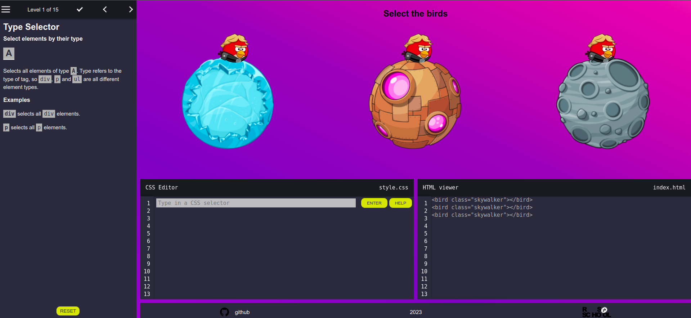

# CSS Diner

Simulator for learning css selectors.


## Deploy

https://alexpashchuk-css-diner.netlify.app/

## Install instructions:

```bash
1. git clone https://github.com/alexpashchuk/css-diner.git
2. cd css-diner
3. npm i
4. npm run start
```

### Used technologies

- JavaScript
- TypeScript
- CSS
- Webpack
- Eslint

## Screenshot


